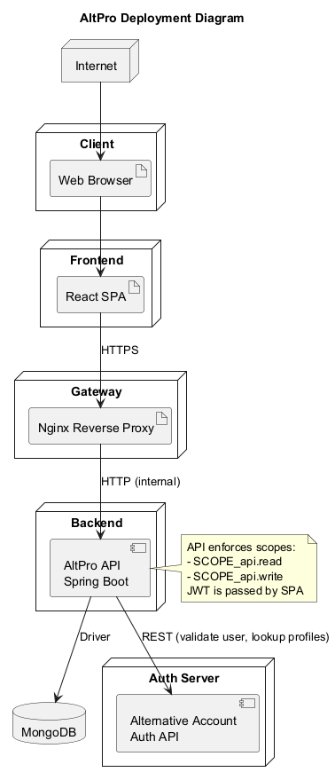
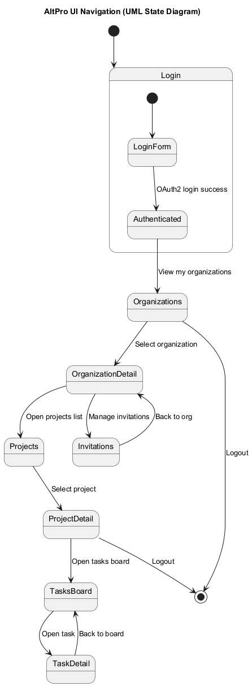

# AltPro – Projekto ataskaita

## 1. Sprendžiamo uždavinio aprašymas
**Sistemos paskirtis:**  
AltPro yra projektų ir užduočių valdymo sistema, skirta komandoms planuoti darbus, sekti progresą ir bendradarbiauti. Sistema sujungia projektus, užduotis, komentarus ir narių valdymą vienoje platformoje, užtikrina saugią prieigą per OAuth2 (Alternative Account) ir teisių kontrolę.

**Funkciniai reikalavimai:**  
- Organizacijų kūrimas ir valdymas (pavadinimas, aprašymas, nariai, rolės)  
- Projektų kūrimas, peržiūra, atnaujinimas ir šalinimas organizacijos kontekste  
- Užduočių kūrimas ir sąrašų peržiūra pagal projektą; būsenos ir prioritetai  
- Komentarų kūrimas prie užduočių  
- Kvietimų siuntimas prisijungti prie organizacijos (pagal vartotojo vardą arba el. paštą)  
- Prieigos teisės pagal rolę ir OAuth2 sritis (`api.read`, `api.write`)  

## 2. Sistemos architektūra
UML Deployment diagrama (anglų k.):  


Trumpai: Vartotojas naršo React SPA per Nginx reverse proxy; SPA autentikuojasi ir perduoda JWT į Spring Boot API; API bendrauja su MongoDB ir tikrina naudotojo profilį per Auth serverio REST API.

## 3. Naudotojo sąsajos projektas
UML UI navigacijos diagrama (anglų k.):  


Diagrama parodo pagrindinių langų (Login, Organizations, Projects, Tasks) navigaciją ir grįžimus. Wireframe'ų struktūra atitinka planuojamas realizacijos peržiūras.

## 4. API specifikacija
Pilna OpenAPI specifikacija pateikta faile `api-spec.yaml` (anglų k.). Joje aprašyti visi metodai, grąžinami kodai ir panaudojimo pavyzdžiai.

Greita peržiūra (pavyzdžiai):
- `POST /api/orgs` – sukuria organizaciją  
  Užklausa:
  ```json
  { "name": "New Org", "description": "Team workspace" }
  ```
  Atsakas `201`:
  ```json
  { "id": "org1", "name": "New Org", "description": "Team workspace", "createdAt": "2025-01-01T10:00:00Z", "members": [] }
  ```
- `POST /api/orgs/{orgId}/projects` – sukuria projektą  
- `GET /api/orgs/{orgId}/tasks/project/{projectId}` – grąžina projekto užduotis  
- `POST /api/orgs/{orgId}/comments` – sukuria komentarą užduočiai  
- `POST /api/orgs/{orgId}/invitations` – kviečia naudotoją pagal vardą arba el. paštą  

Autentifikacija: Bearer JWT, sritys `api.read` ir `api.write`.

## 5. Projekto išvados
- Architektūra paprasta ir aiški: SPA + API + Auth + MongoDB; lengva diegti ir plėsti.  
- Teisių valdymas realizuotas per OAuth2 sritys + verslo taisyklės paslaugų sluoksnyje.  
- API struktūros aiškumas ir OpenAPI specifikacija palengvina integraciją su frontend ir trečiosiomis šalimis.  
- Pasirinktos technologijos (Spring Boot, MongoDB, React) suteikia greitą kūrimą ir gerą našumą mažoms–vidutinėms komandoms.

## 6. Pateikimas
Ataskaita pateikiama projekto Git saugykloje (`README.md`). Diagramos (PNG) ir OpenAPI (`api-spec.yaml`) įtraukti į saugyklą.
