# AltPro projekto ataskaita
_Autorius: Tauras Giedraitis, IFF-2/4_

## 1. Sprendžiamo uždavinio aprašymas
- Sistemos paskirtis:
  - „AltPro“ skirta organizacijų projektų ir užduočių valdymui, užtikrinant vieno prisijungimo (SSO) autentifikaciją per atskirą autorizacijos serverį.
  - Naudotojai kuria organizacijas, projektus, užduotis, kviečia narius ir dirba vienoje vietoje su centralizuota prieiga.
- Funkciniai reikalavimai:
  - Taikomosios srities objektai:
    - `Organization` (pavadinimas, aprašymas, nariai)
    - `Project` (priklauso organizacijai, pavadinimas, aprašymas, nariai)
    - `Task` (priklauso projektui, pavadinimas, aprašymas, būsena, prioritetas)
    - `Invitation` (kvietimas prisijungti prie organizacijos)
    - `Comment` (komentaras prie užduoties)
  - API metodai:
    - Organizacijos: sąrašas, kūrimas, peržiūra, atnaujinimas, narių valdymas, kvietimų peržiūra, palikimas
    - Projektai: sąrašas, kūrimas, peržiūra, atnaujinimas, šalinimas
    - Užduotys: sąrašas, kūrimas, peržiūra, atnaujinimas, šalinimas, filtravimas pagal projektą
    - Kvietimai: mano kvietimai, kvietimo priėmimas / atmetimas
    - Komentarai: sąrašas pagal užduotį
  - Hierarchinis API metodas:
    - Pvz. `/api/orgs/{orgId}/projects/{projectId}/tasks` (užduotys konkrečiame organizacijos projekte)
  - Naudotojų rolės:
    - `ADMIN` (organizacijos administratorius): valdo narius, gali kurti/šalinti projektus, keisti nustatymus
    - `MEMBER` (organizacijos narys): gali kurti ir tvarkyti užduotis, komentuoti, dalyvauti projektuose
    - `SVEČIAS` (neprisijungęs vartotojas): gali matyti tik namų puslapį, registruotis, prisijungti
  - Papildomi funkciniai aspektai:
    - OAuth2/OIDC autentifikacija (SSO), prie API prisijungiama su `Bearer` JWT
    - Įvesties validacija ir aiškūs klaidų atsakai
    - Filtravimas ir peržiūra pagal organizaciją/projektą
    - Konfigūruojama per aplinkos kintamuosius (`MONGO_*`, `issuer-uri`)
- Pasirinktų technologijų aprašymas:
  - Klientas: `React` + `TypeScript` + `Vite`
  - API (Resource Server): `Spring Boot`, `Spring Security OAuth2 Resource Server`, `MongoDB`, RESTful API (JSON over HTTPS)
  - Autorizacija (Authorization Server): `Spring Boot`, `Spring Authorization Server`, `MongoDB`
  - Tarpinis sluoksnis: `Nginx` reverse proxy
  - Diegimo aplinka: `Ubuntu VPS`

## 2. Sistemos architektūra
- Diegimo diagrama:

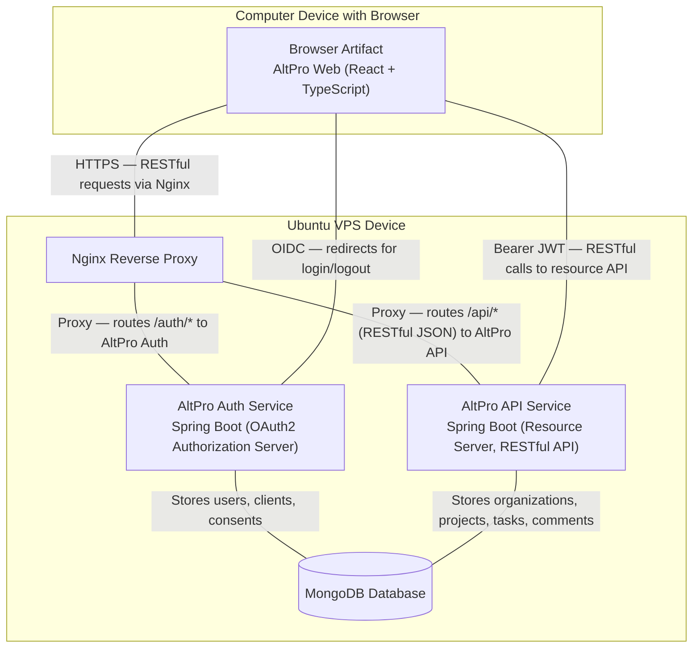

- Diagramos paaiškinimas:
  - Klientas per `Nginx` jungiasi prie dviejų paslaugų: `AltPro Auth` (SSO) ir `AltPro API` (resursų serveris).
  - Abi paslaugos naudoja tą pačią `MongoDB` duomenų bazę: Auth saugo naudotojus, klientus ir sutikimus; API — domeno duomenis (organizacijos, projektai, užduotys, komentarai).
  - Naršyklė gauna OIDC identiteto žetoną, o prie API prisijungia su `Bearer` JWT.

## 3. Naudotojo sąsajos projektas
- Žemiau pateikiama kiekvieno lango pora: pirma „wireframe“, po to atitinkama realizacijos ekrano kopija.


_Home — Wireframe_

_Home — Realizacijos ekrano kopija_


_Dashboard — Wireframe_

_Dashboard — Realizacijos ekrano kopija_

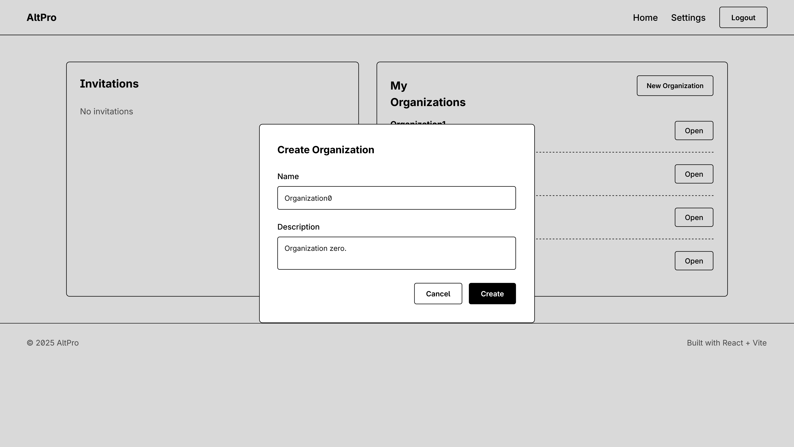
_Organization Create — Wireframe_
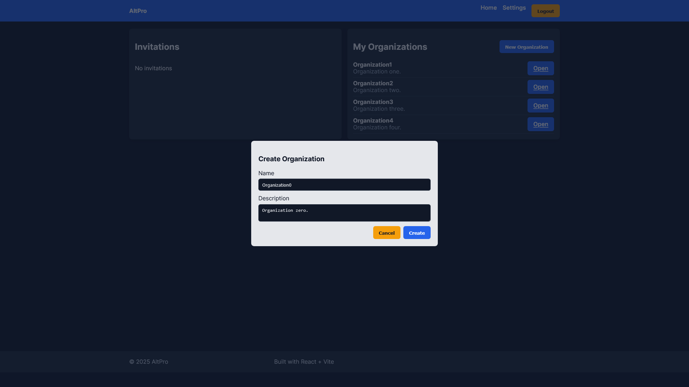
_Organization Create — Realizacijos ekrano kopija_


_Organization Home — Wireframe_

_Organization Home — Realizacijos ekrano kopija_


_Organization Settings — Wireframe_

_Organization Settings — Realizacijos ekrano kopija_

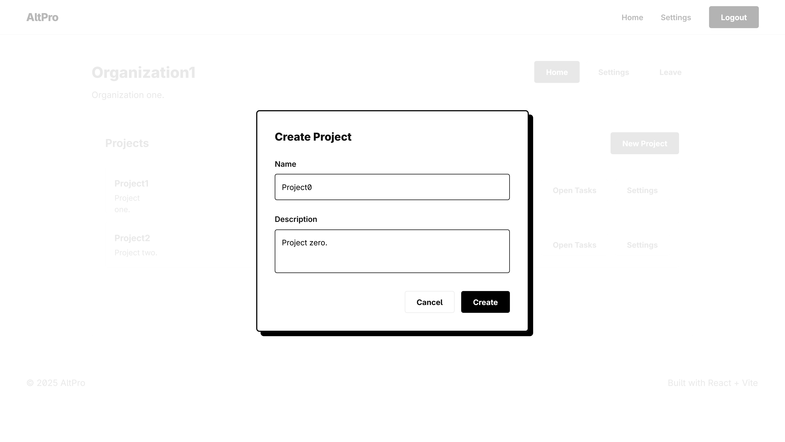
_Project Create — Wireframe_
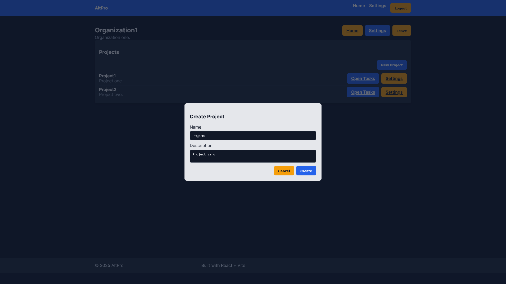
_Project Create — Realizacijos ekrano kopija_

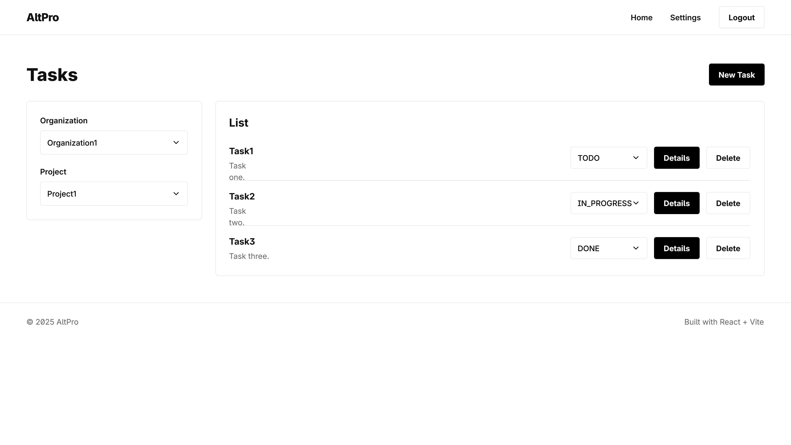
_Project Home — Wireframe_
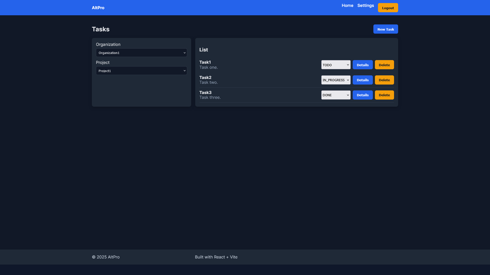
_Project Home — Realizacijos ekrano kopija_


_Project Settings — Wireframe_

_Project Settings — Realizacijos ekrano kopija_

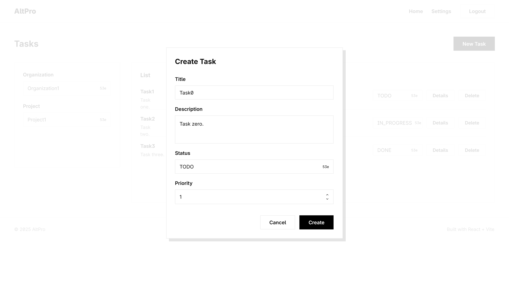
_Task Create — Wireframe_
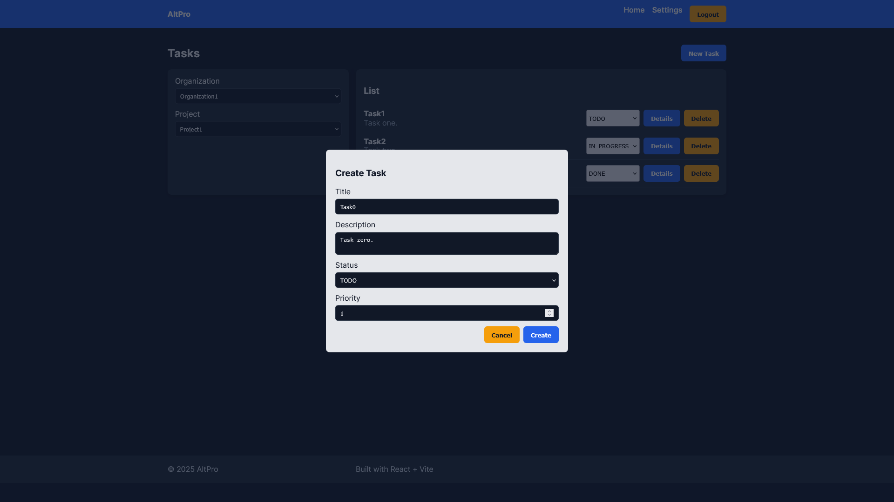
_Task Create — Realizacijos ekrano kopija_

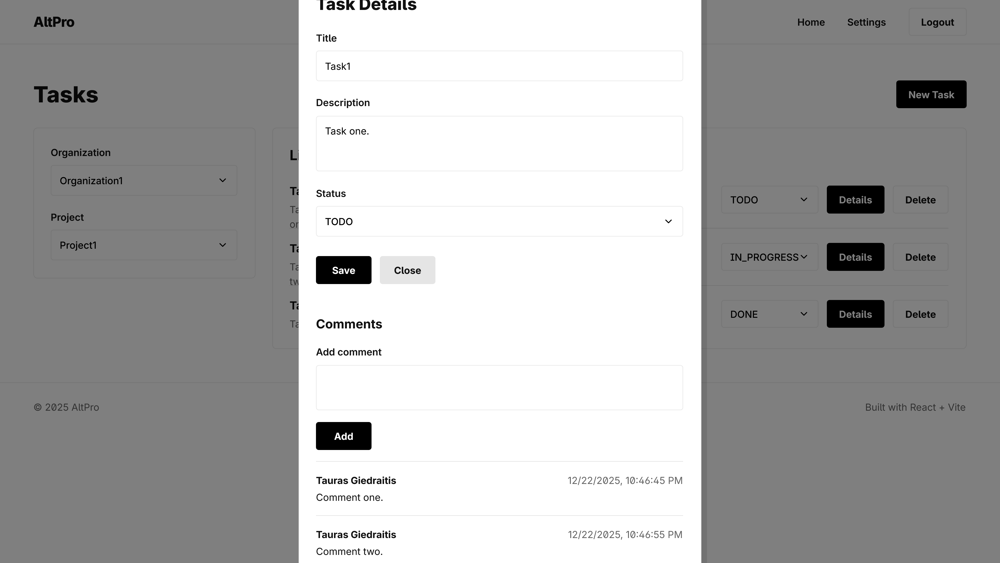
_Task Details — Wireframe_
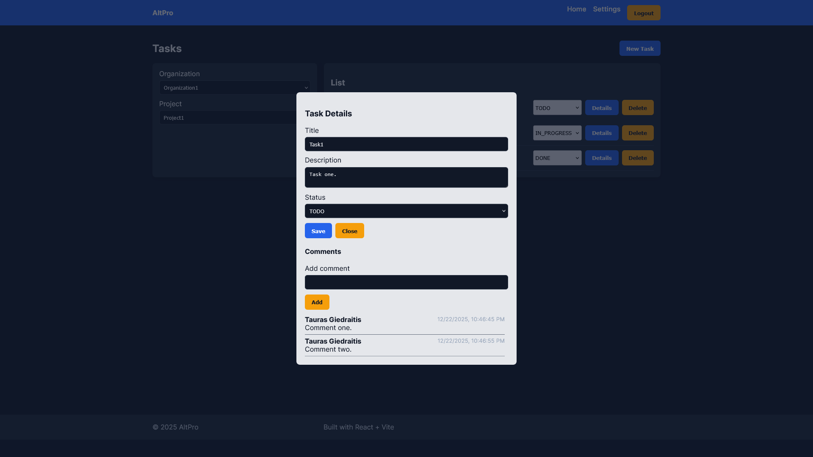
_Task Details — Realizacijos ekrano kopija_

## OpenAPI specifikacija
OpenAPI specifikacijos failą (api-spec.yaml) galima rasti projekto repozitorijoje:
`./api-spec.yaml`

### API pagrindai
- **Base URL**: `http://localhost:9001` (development) / `https://api.altpro.com` (production)
- **Autentifikacija**: Bearer token (JWT)
- **Formatas**: JSON (RESTful)
- **HTTP metodai**: GET, POST, PUT, DELETE

### Pagrindiniai endpoint'ai
#### Organizacijos (`/api/orgs`)
```
POST   /api/orgs              - Sukurti organizaciją
GET    /api/orgs              - Gauti vartotojo organizacijas
GET    /api/orgs/{id}         - Gauti organizaciją pagal ID
PUT    /api/orgs/{id}         - Atnaujinti organizaciją
DELETE /api/orgs/{id}         - Ištrinti organizaciją
POST   /api/orgs/{id}/members - Pridėti narį
PUT    /api/orgs/{id}/members/{memberId} - Atnaujinti nario rolę
DELETE /api/orgs/{id}/members/{memberId} - Pašalinti narį
```

#### Projektai (`/api/orgs/{orgId}/projects`)
```
POST   /api/orgs/{orgId}/projects        - Sukurti projektą
GET    /api/orgs/{orgId}/projects        - Gauti organizacijos projektus
GET    /api/orgs/{orgId}/projects/{id}   - Gauti projektą pagal ID
PUT    /api/orgs/{orgId}/projects/{id}   - Atnaujinti projektą
DELETE /api/orgs/{orgId}/projects/{id}   - Ištrinti projektą
```

#### Užduotys (`/api/orgs/{orgId}/tasks`)
```
POST   /api/orgs/{orgId}/tasks                    - Sukurti užduotį
GET    /api/orgs/{orgId}/tasks                    - Gauti organizacijos užduotis
GET    /api/orgs/{orgId}/tasks/{id}               - Gauti užduotį pagal ID
PUT    /api/orgs/{orgId}/tasks/{id}               - Atnaujinti užduotį
DELETE /api/orgs/{orgId}/tasks/{id}               - Ištrinti užduotį
GET    /api/orgs/{orgId}/tasks/project/{projectId} - Gauti projekto užduotis
```

#### Komentarai (`/api/orgs/{orgId}/comments`)
```
POST   /api/orgs/{orgId}/comments                 - Sukurti komentarą
GET    /api/orgs/{orgId}/comments                 - Gauti organizacijos komentarus
GET    /api/orgs/{orgId}/comments/{id}            - Gauti komentarą pagal ID
PUT    /api/orgs/{orgId}/comments/{id}            - Atnaujinti komentarą
DELETE /api/orgs/{orgId}/comments/{id}            - Ištrinti komentarą
GET    /api/orgs/{orgId}/comments/task/{taskId}   - Gauti užduoties komentarus
```

### API naudojimo pavyzdžiai
#### Organizacijos kūrimas
```bash
POST /api/orgs
Authorization: Bearer <jwt-token>
Content-Type: application/json

{
  "name": "Mano Kompanija",
  "description": "Projektų valdymo organizacija"
}
```

**Atsakymas (201 Created)**:
```json
{
  "id": "64f1a2b3c4d5e6f7g8h9i0j",
  "name": "Mano Kompanija",
  "description": "Projektų valdymo organizacija",
  "createdAt": "2024-12-21T10:00:00Z",
  "members": [
    {
      "userId": "user123",
      "role": "ADMIN"
    }
  ]
}
```

#### Užduoties kūrimas
```bash
POST /api/orgs/64f1a2b3c4d5e6f7g8h9i0j/tasks
Authorization: Bearer <jwt-token>
Content-Type: application/json

{
  "title": "Implementuoti vartotojo autentifikaciją",
  "description": "Pridėti OAuth2 integraciją su JWT tokens",
  "status": "TODO",
  "priority": 4,
  "assignee": "user456"
}
```

**Atsakymas (201 Created)**:
```json
{
  "id": "64f1a2b3c4d5e6f7g8h9i0k",
  "projectId": "64f1a2b3c4d5e6f7g8h9i0l",
  "title": "Implementuoti vartotojo autentifikaciją",
  "description": "Pridėti OAuth2 integraciją su JWT tokens",
  "status": "TODO",
  "priority": 4,
  "createdAt": "2024-12-21T11:30:00Z",
  "assignee": "user456"
}
```

### Galimi atsakymų kodai
- **200 OK** - Sėkmingas užklausa
- **201 Created** - Resursas sukurtas
- **204 No Content** - Resursas ištrintas
- **400 Bad Request** - Klaidingi duomenys
- **401 Unauthorized** - Neautorizuota užklausa
- **403 Forbidden** - Nepakanka teisių
- **404 Not Found** - Resursas nerastas
- **500 Internal Server Error** - Serverio klaida

## 5. Projekto išvados
### Pagrindiniai pasiekimai:
- Klientas, API ir autorizacija veikia atskiruose serveriuose (per `Nginx`).
- Įdiegta OAuth2/OIDC autentifikacija ir autorizacija su JWT (Access tokens, PKCE).
- Sukurta RESTful API su pilnu CRUD funkcionalumu (organizacijos, projektai, užduotys, komentarai).
- Hierarchiniai endpoint’ai atitinka ryšius (`/api/orgs/{orgId}/projects/...`).
- Integruota `MongoDB` duomenų bazė ir validacija.
- API dokumentuota su OpenAPI 3.0 (`api-spec.yaml`, suderinama su `springdoc`).

### Panaudotos technologijos:
- Frontend: React 18 + TypeScript + Vite
- Backend (Resource Server): Spring Boot 3.5 + Spring Security + Spring Data MongoDB
- Autorizacija: Spring Authorization Server (OAuth2/OIDC)
- Duomenų bazė: MongoDB
- API dokumentacija: OpenAPI 3.0 (springdoc UI)
