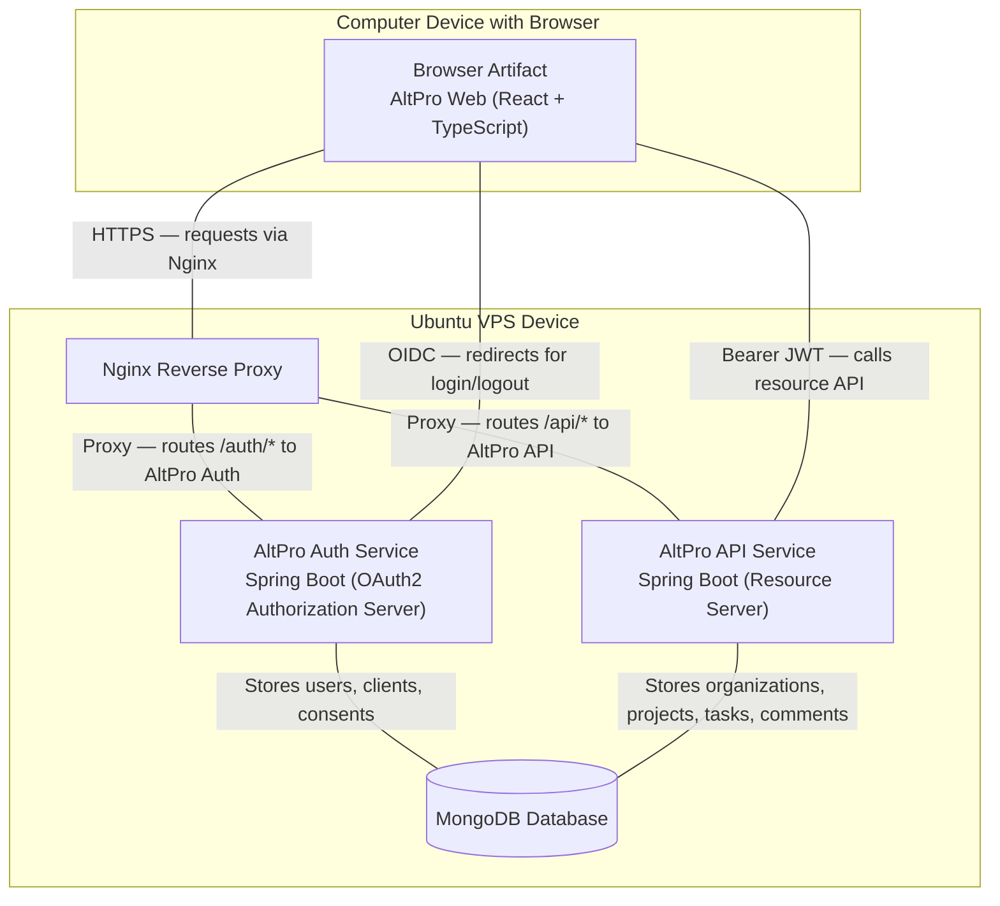
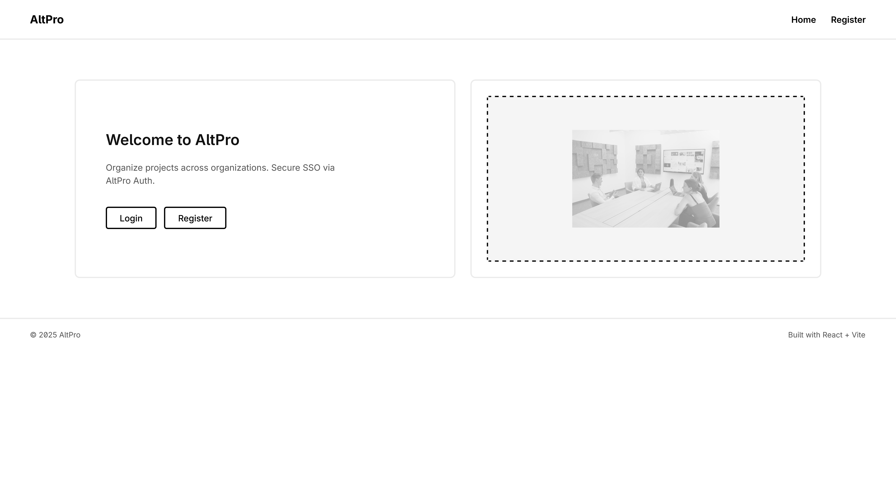
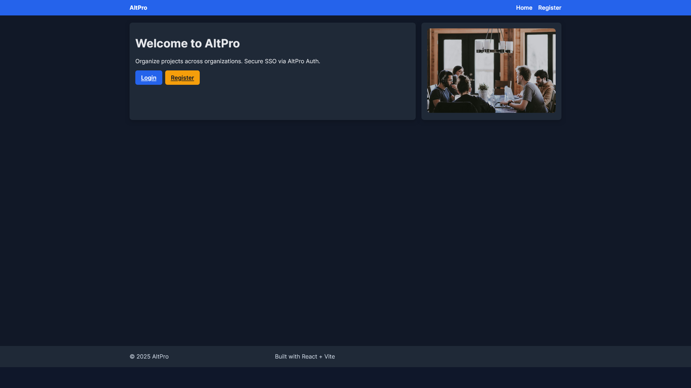
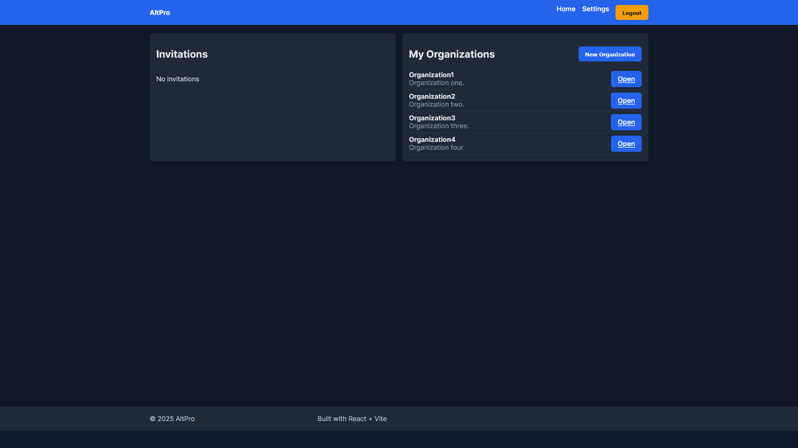
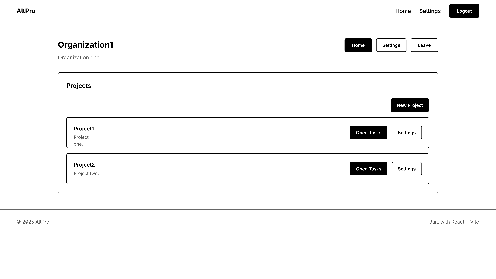
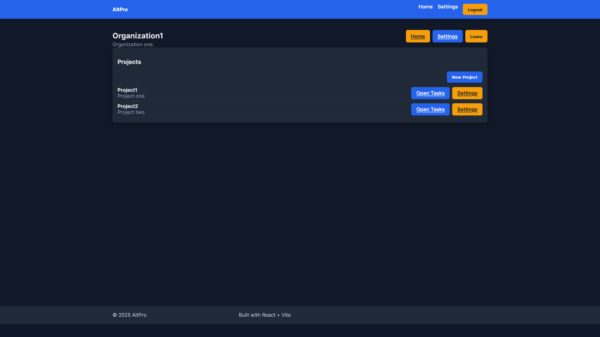
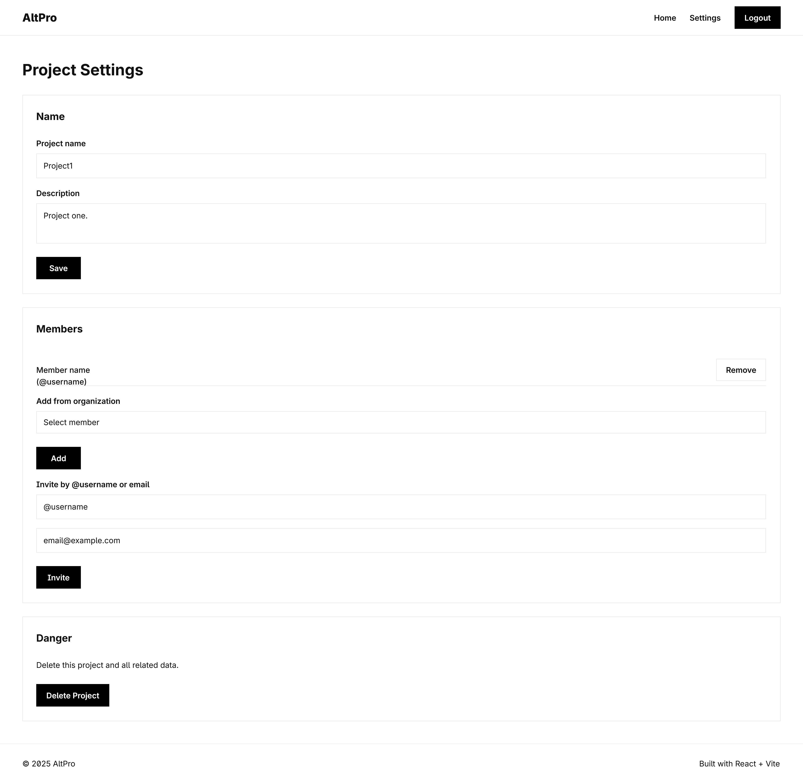
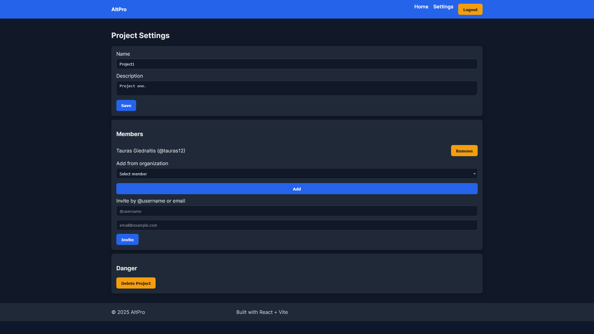
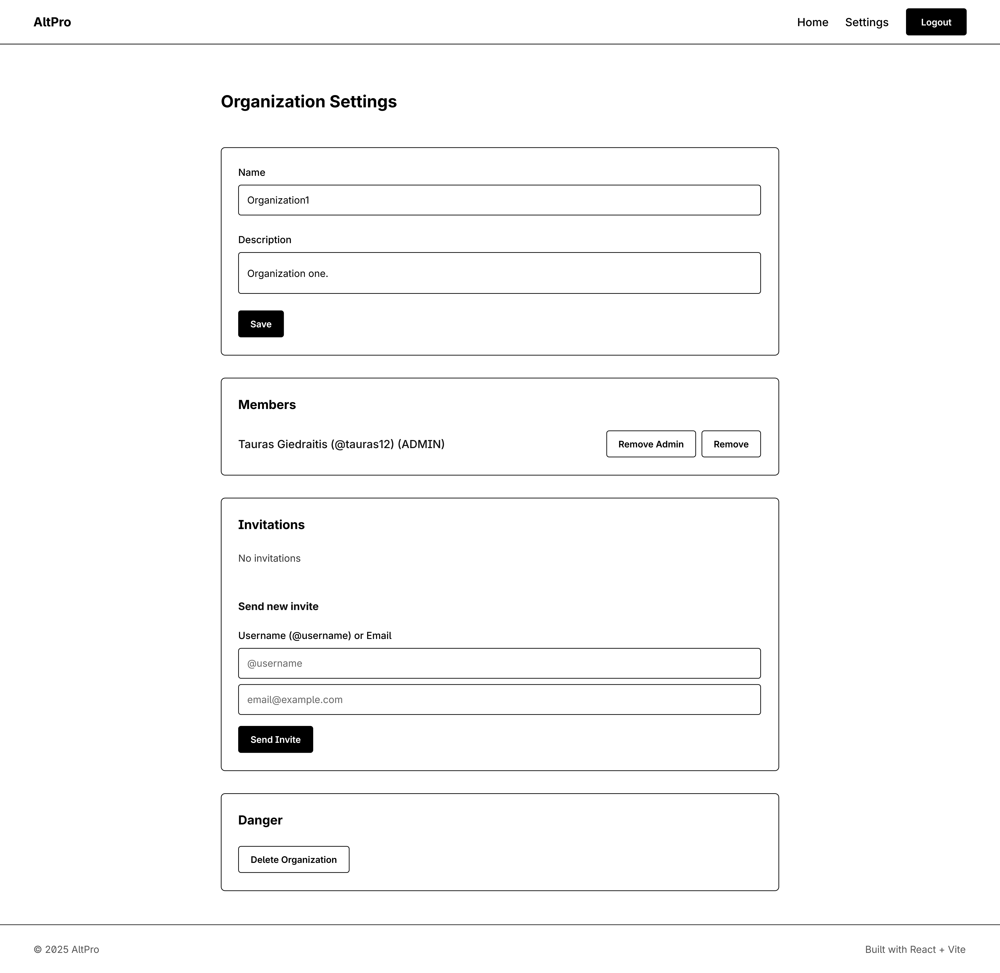
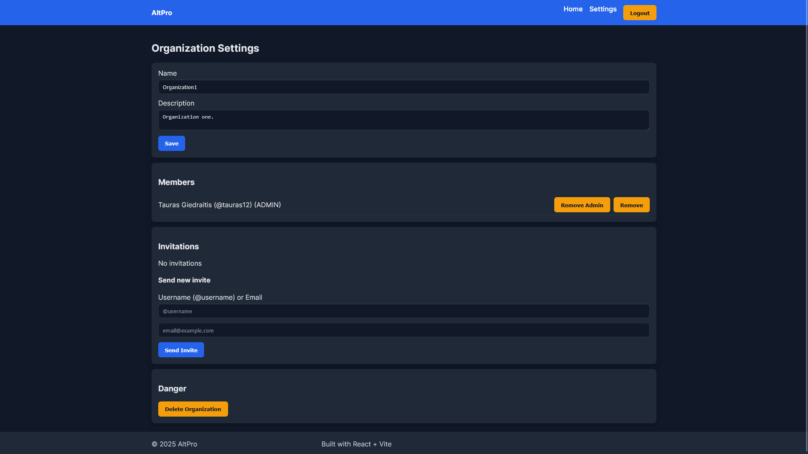

# AltPro projekto ataskaita

## 1. Sprendžiamo uždavinio aprašymas
- Sistemos paskirtis:
  - „AltPro“ skirta organizacijų projektų ir užduočių valdymui, užtikrinant vieno prisijungimo (SSO) autentifikaciją per atskirą autorizacijos serverį.
  - Naudotojai kuria organizacijas, projektus, užduotis, kviečia narius ir dirba vienoje vietoje su centralizuota prieiga.
- Funkciniai reikalavimai:
  - Taikomosios srities objektai:
    - `Organization` (pavadinimas, aprašymas, nariai)
    - `Project` (priklauso organizacijai, pavadinimas, aprašymas, nariai)
    - `Task` (priklauso projektui, pavadinimas, aprašymas, būsena, prioritetas)
    - `Invitation` (kvietimas prisijungti prie organizacijos)
    - `Comment` (komentaras prie užduoties)
  - API metodai:
    - Organizacijos: sąrašas, kūrimas, peržiūra, atnaujinimas, narių valdymas, kvietimų peržiūra, palikimas
    - Projektai: sąrašas, kūrimas, peržiūra, atnaujinimas, šalinimas
    - Užduotys: sąrašas, kūrimas, peržiūra, atnaujinimas, šalinimas, filtravimas pagal projektą
    - Kvietimai: mano kvietimai, kvietimo priėmimas / atmetimas
    - Komentarai: sąrašas pagal užduotį
  - Hierarchinis API metodas:
    - Pvz. `/api/orgs/{orgId}/projects/{projectId}/tasks` (užduotys konkrečiame organizacijos projekte)
  - Naudotojų rolės:
    - `ADMIN` (organizacijos administratorius): valdo narius, gali kurti/šalinti projektus, keisti nustatymus
    - `MEMBER` (organizacijos narys): gali kurti ir tvarkyti užduotis, komentuoti, dalyvauti projektuose
  - Papildomi funkciniai aspektai:
    - OAuth2/OIDC autentifikacija (SSO), prie API prisijungiama su `Bearer` JWT
    - Įvesties validacija ir aiškūs klaidų atsakai
    - Filtravimas ir peržiūra pagal organizaciją/projektą
    - Konfigūruojama per aplinkos kintamuosius (`MONGO_*`, `issuer-uri`)
- Pasirinktų technologijų aprašymas:
  - Klientas: `React` + `TypeScript` + `Vite`
  - API (Resource Server): `Spring Boot`, `Spring Security OAuth2 Resource Server`, `MongoDB`
  - Autorizacija (Authorization Server): `Spring Boot`, `Spring Authorization Server`, `MongoDB`
  - Tarpinis sluoksnis: `Nginx` reverse proxy
  - Diegimo aplinka: `Ubuntu VPS`

## 2. Sistemos architektūra
- Diegimo diagrama (UML principu, English):

<figure>
  
  <figcaption>Deployment Diagram — AltPro (English)</figcaption>
</figure>

- Diagramos paaiškinimas:
  - Klientas per `Nginx` jungiasi prie dviejų paslaugų: `AltPro Auth` (SSO) ir `AltPro API` (resursų serveris).
  - Abi paslaugos naudoja tą pačią `MongoDB` duomenų bazę: Auth saugo naudotojus, klientus ir sutikimus; API — domeno duomenis (organizacijos, projektai, užduotys, komentarai).
  - Naršyklė gauna OIDC identiteto žetoną, o prie API prisijungia su `Bearer` JWT.

## 3. Naudotojo sąsajos projektas
- Žemiau pateikiama kiekvieno lango pora: pirma „wireframe“, po to atitinkama realizacijos ekrano kopija. Į `images/` katalogą įkelkite `.png` failus tiksliai tokiais pavadinimais, ir jie automatiškai bus matomi.

<figure>
  
  <figcaption>Home — Wireframe</figcaption>
</figure>
<figure>
  
  <figcaption>Home — Realizacijos ekrano kopija</figcaption>
</figure>

<figure>
  
  <figcaption>Dashboard — Wireframe</figcaption>
</figure>
<figure>
  
  <figcaption>Dashboard — Realizacijos ekrano kopija</figcaption>
</figure>

<figure>
  
  <figcaption>Organizations — Wireframe</figcaption>
</figure>
<figure>
  
  <figcaption>Organizations — Realizacijos ekrano kopija</figcaption>
</figure>

<figure>
  
  <figcaption>Projects — Wireframe</figcaption>
</figure>
<figure>
  
  <figcaption>Projects — Realizacijos ekrano kopija</figcaption>
</figure>

<figure>
  
  <figcaption>Tasks — Wireframe</figcaption>
</figure>
<figure>
  
  <figcaption>Tasks — Realizacijos ekrano kopija</figcaption>
</figure>

<figure>
  
  <figcaption>Organization Home — Wireframe</figcaption>
</figure>
<figure>
  
  <figcaption>Organization Home — Realizacijos ekrano kopija</figcaption>
</figure>

<figure>
  
  <figcaption>Project Settings — Wireframe</figcaption>
</figure>
<figure>
  
  <figcaption>Project Settings — Realizacijos ekrano kopija</figcaption>
</figure>

<figure>
  
  <figcaption>Organization Settings — Wireframe</figcaption>
</figure>
<figure>
  
  <figcaption>Organization Settings — Realizacijos ekrano kopija</figcaption>
</figure>

<figure>
  
  <figcaption>Auth Callback — Wireframe</figcaption>
</figure>
<figure>
  
  <figcaption>Auth Callback — Realizacijos ekrano kopija</figcaption>
</figure>

<figure>
  
  <figcaption>Auto Login — Wireframe</figcaption>
</figure>
<figure>
  
  <figcaption>Auto Login — Realizacijos ekrano kopija</figcaption>
</figure>

<figure>
  
  <figcaption>Logout — Wireframe</figcaption>
</figure>
<figure>
  
  <figcaption>Logout — Realizacijos ekrano kopija</figcaption>
</figure>

## 4. API specifikacija
- Struktūriškai aprašyta OpenAPI formatu (atskiras failas, anglų k.): `api-spec.yaml`.
- Kiekvienam API metodui pateikti galimi atsako kodai ir panaudojimo pavyzdžiai (užklausa, atsakymas).
- Pastaba: specifikacija suderinta su esamu kliento naudojimu (`altpro-client/src`) ir serverio konfigūracija (`altpro-api`).

## 5. Projekto išvados
- Atskyrus autorizacijos serverį nuo resursų serverio, pasiekiamas saugus ir lankstus SSO.
- Hierarchinis API dizainas (`/api/orgs/{orgId}/projects/...`) natūraliai atspindi domeno ryšius ir supaprastina teisių taikymą.
- `MongoDB` tinka greitam prototipavimui ir dokumentiniams duomenims; esant poreikiui, galima keisti saugyklą.
- `React + TypeScript + Vite` leidžia kurti greitą ir tipais saugų klientą.
- `Nginx` centralizuoja srautą ir palengvina TLS, maršrutizavimą bei mastelį.
