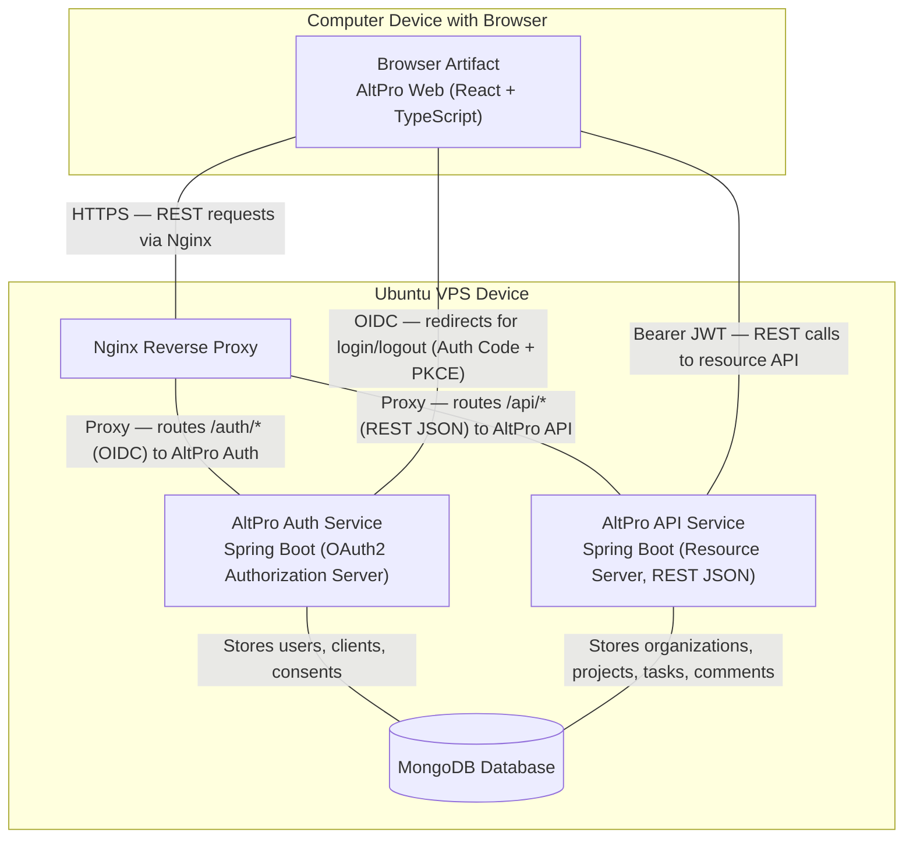
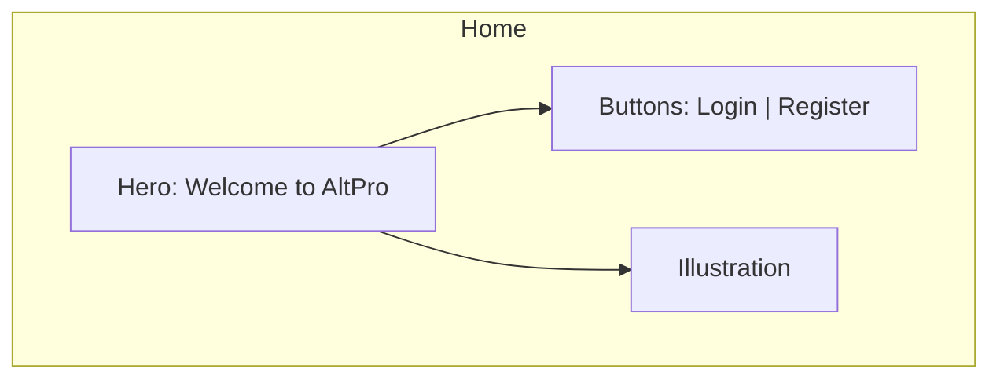
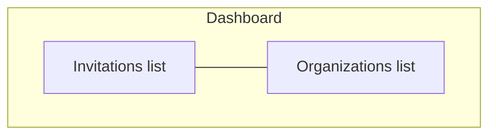
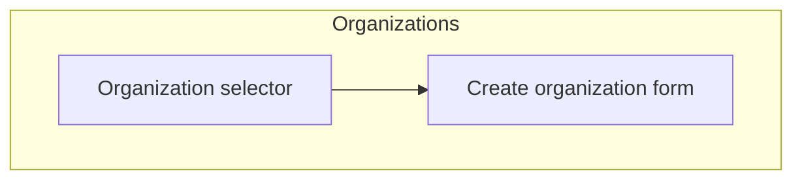
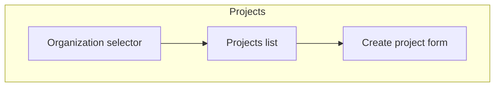
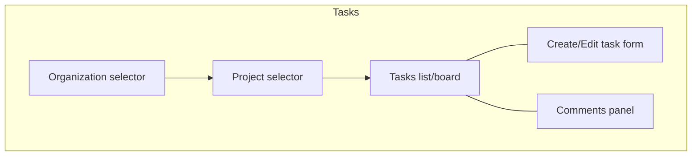
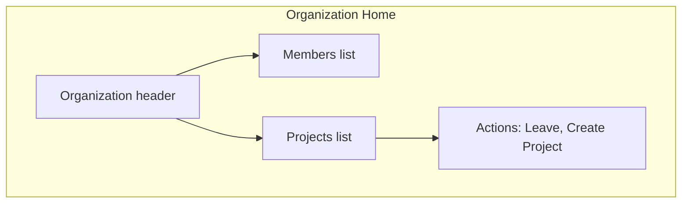
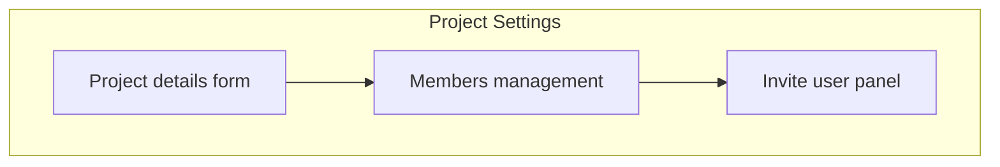
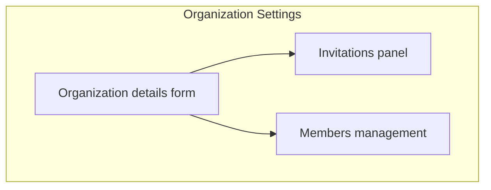
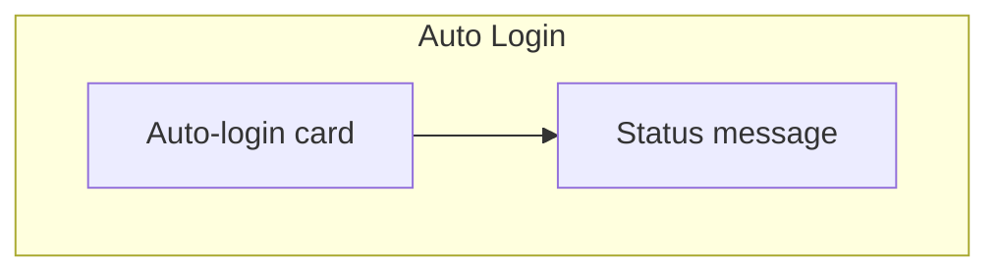

# AltPro projekto ataskaita
Autorius: Tauras Giedraitis, IFF-2/4

## 1. Sprendžiamo uždavinio aprašymas
- Sistemos paskirtis:
  - „AltPro“ skirta organizacijų projektų ir užduočių valdymui, užtikrinant vieno prisijungimo (SSO) autentifikaciją per atskirą autorizacijos serverį.
  - Naudotojai kuria organizacijas, projektus, užduotis, kviečia narius ir dirba vienoje vietoje su centralizuota prieiga.
- Funkciniai reikalavimai:
  - Taikomosios srities objektai:
    - `Organization` (pavadinimas, aprašymas, nariai)
    - `Project` (priklauso organizacijai, pavadinimas, aprašymas, nariai)
    - `Task` (priklauso projektui, pavadinimas, aprašymas, būsena, prioritetas)
    - `Invitation` (kvietimas prisijungti prie organizacijos)
    - `Comment` (komentaras prie užduoties)
  - API metodai:
    - Organizacijos: sąrašas, kūrimas, peržiūra, atnaujinimas, narių valdymas, kvietimų peržiūra, palikimas
    - Projektai: sąrašas, kūrimas, peržiūra, atnaujinimas, šalinimas
    - Užduotys: sąrašas, kūrimas, peržiūra, atnaujinimas, šalinimas, filtravimas pagal projektą
    - Kvietimai: mano kvietimai, kvietimo priėmimas / atmetimas
    - Komentarai: sąrašas pagal užduotį
  - Hierarchinis API metodas:
    - Pvz. `/api/orgs/{orgId}/projects/{projectId}/tasks` (užduotys konkrečiame organizacijos projekte)
  - Naudotojų rolės:
    - `ADMIN` (organizacijos administratorius): valdo narius, gali kurti/šalinti projektus, keisti nustatymus
    - `MEMBER` (organizacijos narys): gali kurti ir tvarkyti užduotis, komentuoti, dalyvauti projektuose
    - `SVEČIAS` (neprisijungęs vartotojas): gali matyti tik namų puslapį, registruotis, prisijungti
  - Papildomi funkciniai aspektai:
    - OAuth2/OIDC autentifikacija (SSO), prie API prisijungiama su `Bearer` JWT
    - Įvesties validacija ir aiškūs klaidų atsakai
    - Filtravimas ir peržiūra pagal organizaciją/projektą
    - Konfigūruojama per aplinkos kintamuosius (`MONGO_*`, `issuer-uri`)
- Pasirinktų technologijų aprašymas:
  - Klientas: `React` + `TypeScript` + `Vite`
  - API (Resource Server): `Spring Boot`, `Spring Security OAuth2 Resource Server`, `MongoDB`, REST (JSON over HTTPS)
  - Autorizacija (Authorization Server): `Spring Boot`, `Spring Authorization Server`, `MongoDB`
  - Tarpinis sluoksnis: `Nginx` reverse proxy
  - Diegimo aplinka: `Ubuntu VPS`

## 2. Sistemos architektūra
- Diegimo diagrama (UML principu, English):



- Diagramos paaiškinimas:
  - Klientas per `Nginx` jungiasi prie dviejų paslaugų: `AltPro Auth` (SSO) ir `AltPro API` (resursų serveris).
  - Abi paslaugos naudoja tą pačią `MongoDB` duomenų bazę: Auth saugo naudotojus, klientus ir sutikimus; API — domeno duomenis (organizacijos, projektai, užduotys, komentarai).
  - Naršyklė gauna OIDC identiteto žetoną, o prie API prisijungia su `Bearer` JWT.

## 3. Naudotojo sąsajos projektas
- Žemiau pateikiama kiekvieno lango pora: pirma „wireframe“ (Mermaid diagrama), po to atitinkama realizacijos ekrano kopija.


_Home — Wireframe (Mermaid)_

_Home — Realizacijos ekrano kopija_


_Dashboard — Wireframe (Mermaid)_

_Dashboard — Realizacijos ekrano kopija_


_Organizations — Wireframe (Mermaid)_

_Organizations — Realizacijos ekrano kopija_


_Projects — Wireframe (Mermaid)_

_Projects — Realizacijos ekrano kopija_


_Tasks — Wireframe (Mermaid)_

_Tasks — Realizacijos ekrano kopija_


_Organization Home — Wireframe (Mermaid)_

_Organization Home — Realizacijos ekrano kopija_


_Project Settings — Wireframe (Mermaid)_

_Project Settings — Realizacijos ekrano kopija_


_Organization Settings — Wireframe (Mermaid)_

_Organization Settings — Realizacijos ekrano kopija_


_Auto Login — Wireframe (Mermaid)_

_Auto Login — Realizacijos ekrano kopija_

## OpenAPI specifikacija

OpenAPI specifikacijos failą (api-spec.yaml) galima rasti projekto repozitorijoje:
`./api-spec.yaml`

API dokumentacijos pavyzdys
GET `/api/orgs` — Gauti visas organizacijas

Responses:
- 200 OK — Grąžina organizacijų sąrašą
- 401 Unauthorized — Vartotojas neautentifikuotas
- 403 Forbidden — Neturi prieigos teisių
- 500 Internal Server Error — Serverio klaida

Response Schema (Organization):

```json
{
  "name": "KTU Dev Club",
  "description": "Student projects organization",
  "createdAt": "2025-10-01T10:00:00Z",
  "members": [
    { "userId": "user1", "role": "ADMIN" },
    { "userId": "user2", "role": "MEMBER" }
  ]
}
```

GET `/api/orgs/{id}` — Gauti vieną organizaciją

Parameters:
- `id` (path, required) — Organizacijos ID (string)

Responses:
- 200 OK — Grąžina organizacijos informaciją
- 404 Not Found — Organizacija nerasta
- 401 Unauthorized — Vartotojas neautentifikuotas
- 403 Forbidden — Neturi prieigos teisių

## 5. Projekto išvados
- Atskyrus autorizacijos serverį nuo resursų serverio, pasiekiamas saugus ir lankstus SSO.
- Hierarchinis API dizainas (`/api/orgs/{orgId}/projects/...`) natūraliai atspindi domeno ryšius ir supaprastina teisių taikymą.
- `MongoDB` tinka greitam prototipavimui ir dokumentiniams duomenims; esant poreikiui, galima keisti saugyklą.
- `React + TypeScript + Vite` leidžia kurti greitą ir tipais saugų klientą.
- `Nginx` centralizuoja srautą ir palengvina TLS, maršrutizavimą bei mastelį.
